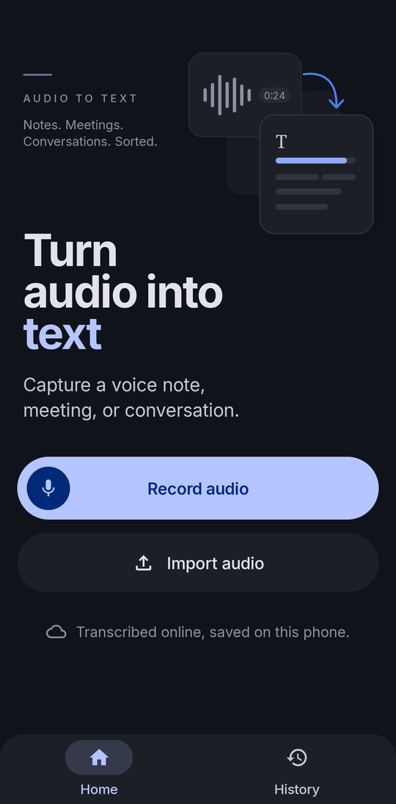
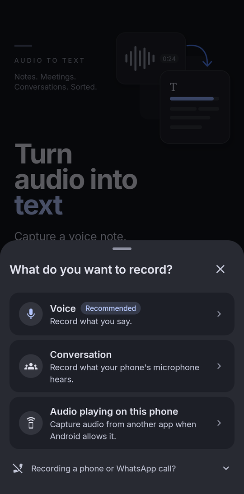
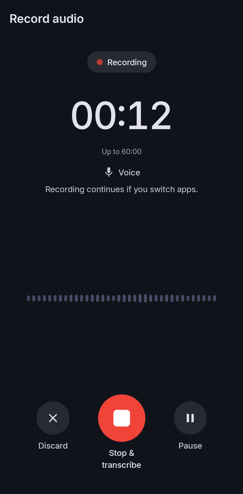
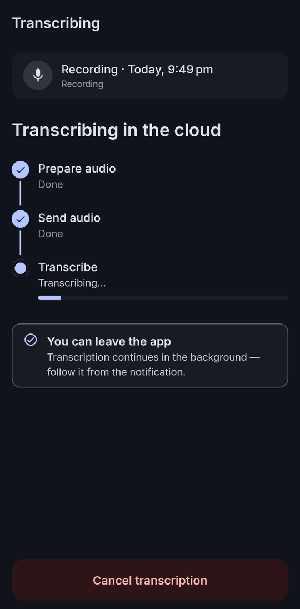
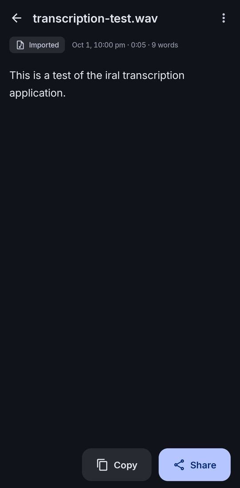
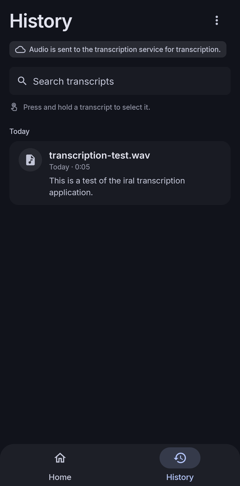
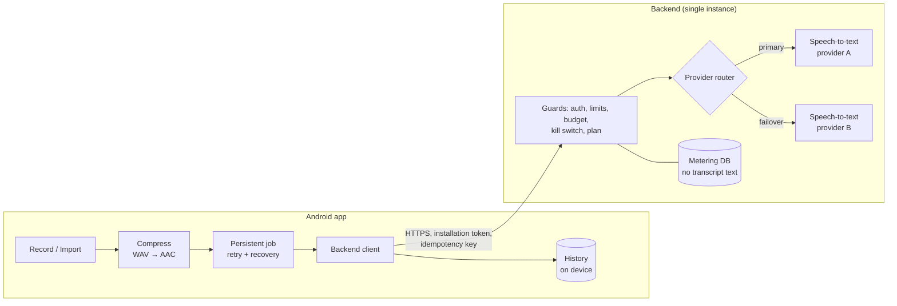

<h1 align="center">Irela</h1>

<p align="center">
  <b>An Android app that turns voice notes, meetings and audio files into text, with Hindi and Hinglish support.</b>
</p>

<p align="center">
  
  
  
</p>

<p align="center">
  <a href="#screenshots">Screenshots</a> ·
  <a href="#download-apk">Download APK</a> ·
  <a href="#how-it-works">How it works</a> ·
  <a href="#architecture">Architecture</a> ·
  <a href="#setup">Setup</a>
</p>

---

## Overview

**Irela is a personal Android transcription application** that I designed and
built, together with the backend service it runs on. You record or import
audio on your phone, such as a voice note, a meeting, a conversation or a voice
message shared from a chat app, and Irela returns a transcript that stays on
the device.

**The problem it solves.** Accurate speech-to-text for everyday phone audio,
especially Hindi and code-mixed Hinglish, normally means either a heavy
on-device model or an app that calls a cloud API with an embedded key that
anyone can extract. Irela uses its own backend instead. The app never holds a
provider key; the backend authenticates each installation, enforces limits and
a spending budget, and routes the audio to a primary speech-to-text provider,
with automatic failover to a backup.

Irela started as an on-device speech-recognition prototype. That engine proved
too slow and too hot for long recordings, so production transcription moved to
the backend. The on-device engine remains available for development.

## Screenshots

<table>
  <tr>
    <td align="center"><br><sub><b>Home</b></sub></td>
    <td align="center"><br><sub><b>Choose what to record</b></sub></td>
    <td align="center"><br><sub><b>Recording</b></sub></td>
  </tr>
  <tr>
    <td align="center"><br><sub><b>Transcribing</b></sub></td>
    <td align="center"><br><sub><b>Transcript</b></sub></td>
    <td align="center"><br><sub><b>History</b></sub></td>
  </tr>
</table>

<sub>Captured on a physical Android 16 device. The transcript shows the real,
unedited output for a synthesized test sentence ("This is a test of the Irela
transcription application."); the invented name "Irela" came out as "iral".</sub>

## Download APK

<!--
  Maintainer note: after creating the GitHub repository, publish a release
  (tag v1.0) with Irela-v1.0.apk attached as an asset, then replace
  <your-username>/<your-repo> in the link below.
-->

**Try the Android app using the latest APK release:**

> ### [⬇️ Download Irela for Android](https://github.com/<your-username>/<your-repo>/releases/latest)

1. Download `Irela-v1.0.apk` from the release's **Assets**.
2. Open it on your phone and allow installing from that source when Android asks.

**Requirements:** Android 8.0 or newer on a 64-bit ARM device, plus an internet
connection. The free plan includes 20 minutes of transcription per month.

The demo APK is version 1.0. The source code here is version 1.1, which adds a
subscription flow that is not live yet.

## Features

**In the app**

- **Record** with pause and resume, up to 60 minutes. Recording continues when
  you switch apps.
- **Capture modes:** your voice, a conversation the microphone hears, or audio
  playing from another app (with Android's consent). Call audio cannot be
  captured on Android, and the app explains this.
- **Import** from the file picker, the share sheet or "Open with".
- **Reliable transcription jobs:** uploads are idempotent, progress is polled
  instead of re-uploaded, failures offer **Try again**, and recordings cut off
  by a crash are recovered. Untranscribed audio is never deleted automatically.
- **History** with search, plus transcript view, edit, rename, copy, and share
  as a `.txt` file.
- **Privacy first:** a clear disclosure before the first upload, and
  transcripts stored only on the phone.
- **Usage screen** showing the current plan and remaining allowance.

**In the backend**

- **No keys in the app:** anonymous per-installation tokens, with no user accounts.
- **Abuse and cost protection:** rate limits, daily quotas, registration limits,
  a daily spending budget and a kill switch.
- **Plans enforced server-side:** a free monthly allowance, plus a subscription
  plan verified with Google Play.
- **Resilient routing:** retries, backoff and automatic failover between two
  speech-to-text providers, with persisted provider health.
- **Never pay twice:** finished results are replayed and running jobs are
  joined on retry.
- **Private by design:** usage is metered in SQLite, and transcript text is
  never stored or logged.

## How it works

1. **Capture.** Audio is streamed to a 16 kHz mono WAV file whose header is kept
   current, so even a crash leaves a recoverable recording.
2. **Consent.** Before the first upload, the app explains what is sent where.
3. **Compress and check.** The audio is encoded to AAC (16 kHz mono, 64 kbps)
   and checked against the shared limits (60 minutes, 100 MB).
4. **Authenticate.** On first use the app registers and receives an anonymous
   token. No device identifiers are sent.
5. **Upload.** The audio is sent with an idempotency key, so a retry can never
   start a second paid job.
6. **Guard.** The backend checks the token, rate limits, quotas, budget, kill
   switch, file limits and plan, cheapest check first.
7. **Transcribe.** The backend calls the primary provider and fails over to the
   backup when needed. Audio errors stop immediately.
8. **Wait without re-uploading.** Long jobs report "processing", and the app
   polls with the same key.
9. **Deliver.** The transcript is validated and saved to on-device history. On
   failure the audio is kept, and **Try again** is offered once the relevant
   limit allows it.

## Architecture



| Component | Location | Responsibility |
|---|---|---|
| Android app | [`android/app`](android/app) | UI, recording, import, jobs, history, account and billing client |
| Native module | [`android/lib`](android/lib) | JNI bridge for the optional on-device engine |
| Backend | [`backend/`](backend) | API, authentication, limits, plans, provider routing, billing verification |
| Shared limits | [`shared/limits.json`](shared/limits.json) | One definition of the audio limits, used by both the app and the backend |

Design details: [authentication and abuse protection](docs/CLOUD-AUTH-DESIGN.md),
[provider routing](docs/PROVIDER-ROUTER.md), and
[audio capture on Android](docs/CONVERSATION-CAPTURE.md).

## Tech stack

| Area | Technologies |
|---|---|
| Android app | Kotlin, Jetpack Compose (Material 3), Navigation, ViewModel, coroutines, Google Play Billing |
| Native | C, JNI, CMake, Android NDK, whisper.cpp (optional on-device engine) |
| Backend | Python, FastAPI, Uvicorn, Pydantic, httpx, SQLite |
| Speech-to-text | Deepgram Nova-3 (primary), AssemblyAI Universal (backup); provider settings are fixed on the server |
| Build and test | Gradle, JDK 17, JUnit, Compose UI Test, pytest |
| Deployment | Linux, systemd, a TLS reverse proxy (e.g. Caddy) |

## Setup

### Prerequisites

- **Backend:** Python 3. To transcribe, you also need API keys for the
  speech-to-text providers; the tests run without them.
- **Android:** JDK 17, Android SDK 36, NDK `27.2.12479018` and CMake (all from
  Android Studio's SDK Manager), Git, and an arm64 Android device.

### Backend

```bash
cd backend
python -m venv .venv
source .venv/bin/activate          # Windows PowerShell: .venv\Scripts\Activate.ps1
pip install -r requirements.txt
cp .env.example .env               # then add your provider keys
set -a; . ./.env; set +a
uvicorn app:app --host 127.0.0.1 --port 8080 --workers 1
```

Check it is running with `curl http://127.0.0.1:8080/healthz`. Always run a
single worker. For a production deployment behind TLS, follow
[`backend/DEPLOYMENT.md`](backend/DEPLOYMENT.md).

### Android

```bash
./scripts/fetch-whisper-cpp.sh     # Windows PowerShell: .\scripts\fetch-whisper-cpp.ps1
cd android
./gradlew :app:installDebug -PbackendBaseUrl=https://your-backend.example.org
```

The first command fetches the native sources that the optional on-device engine
is built from. Point Android Studio at `android/`, or create
`android/local.properties` with `sdk.dir=/path/to/Android/sdk`.

A signed release reads its signing values from Gradle properties or environment
variables, never from the repository:

```bash
./gradlew :app:bundleRelease -PrequireSigning -PbackendBaseUrl=https://your-backend.example.org
```

### Common setup issues

| Problem | Fix |
|---|---|
| CMake reports that native sources are missing | Run `scripts/fetch-whisper-cpp.sh` from the repository root |
| Release build refused: no backend URL | Pass `-PbackendBaseUrl=https://…` pointing at a real HTTPS host |
| App cannot reach an `http://` backend | Cleartext is blocked; serve the backend over HTTPS |
| Debug build never transcribes | Without `backendBaseUrl` the on-device engine runs and needs a model file |

## Configuration

**Backend:** environment variables only. The full list with defaults is in
[`backend/.env.example`](backend/.env.example).

| Variable | Purpose |
|---|---|
| `DEEPGRAM_API_KEY` | **Secret.** Primary speech-to-text provider key |
| `ASSEMBLYAI_API_KEY` | **Secret.** Backup provider key (optional) |
| `METERING_DB` | Path to the SQLite database on persistent storage |
| `TRANSCRIPTION_ENABLED` | Kill switch (default `true`) |
| `DAILY_BUDGET_INR` | Stop provider calls once the estimated 24-hour spend reaches this |
| `ADMIN_TOKEN` | **Secret.** Protects the operator usage endpoint |

Audio limits live in [`shared/limits.json`](shared/limits.json); environment
overrides can only tighten them. `.env` files are git-ignored. Never commit
real keys.

**Android:** Gradle properties passed at build time.

| Property | Purpose |
|---|---|
| `backendBaseUrl` | HTTPS backend URL compiled into the app (required for release builds) |
| `releaseKeystore`, `releaseKeystorePassword`, `releaseKeyAlias`, `releaseKeyPassword` | Release signing, from `~/.gradle/gradle.properties` or `RELEASE_*` environment variables |
| `requireSigning` | Fail the build instead of producing an unsigned release |

## Usage

1. Open **Irela** and allow microphone and notification access when asked.
2. Tap **Record audio** and choose what to record, or tap **Import audio**. You
   can also share an audio file or voice message to Irela from another app.
3. Accept the one-time disclosure before your first upload.
4. Follow progress on the **Transcribing** screen, or leave the app; the work
   continues in the background.
5. Read, edit, rename, copy or share the transcript. Everything, including
   failed attempts with **Try again**, is listed in **History**.
6. Open **Usage** from History's menu to see your plan and remaining minutes.

## Testing

| Suite | Command | Latest result |
|---|---|---|
| Backend | `cd backend && python -m pytest -q` | 335 passed |
| Android unit tests | `cd android && ./gradlew :app:testDebugUnitTest` | 665 passed |
| Android device tests | `cd android && ./gradlew :app:connectedDebugAndroidTest` | Requires a connected device |

The backend tests never call a real provider. The suites also include guard
tests for the project's rules:
- no credentials in the app;
- app and backend limits stay in sync;
- release builds require HTTPS and are never debug-signed;
- the privacy disclosure cannot change without a version bump;
- recordings are never deleted by a limit or an expired plan.

## Project structure

```
.
├── android/                     Android app (Gradle)
│   ├── app/src/main/java/com/whispercppdemo/
│   │   ├── account/             Plan and usage from the backend
│   │   ├── billing/             Subscription client
│   │   ├── capture/             What can be recorded, and how
│   │   ├── history/             On-device transcript history
│   │   ├── jobs/                Persistent jobs, retries, cleanup
│   │   ├── media/               Decoding, resampling, AAC encoding, limits
│   │   ├── privacy/             Upload disclosure
│   │   ├── recorder/            Streaming recorder and foreground service
│   │   ├── transcribe/          Engine selection and backend client
│   │   └── ui/                  Compose screens, navigation, theme
│   ├── app/src/test/            Unit tests
│   ├── app/src/androidTest/     Device tests
│   └── lib/                     Native module for the on-device engine
├── backend/                     Python backend
│   ├── app.py                   API and request pipeline
│   ├── client_auth.py           Tokens, rate limits, quotas, budget
│   ├── provider_router.py       Routing and failover
│   ├── provider_health.py       Provider health state machine
│   ├── providers/               Speech-to-text provider clients
│   ├── tests/                   Test suite
│   ├── .env.example             Configuration template
│   └── DEPLOYMENT.md            Production deployment guide
├── shared/limits.json           Audio limits shared by app and backend
├── docs/                        Design documents and screenshots
├── scripts/                     Setup scripts
└── third_party/                 Sources fetched at setup (git-ignored)
```

## Roadmap

These items are **planned, not implemented**:

- Launch the subscription plan and test purchases end to end
- An upgrade option on the free-limit screen
- Playback or export of a failed recording's audio
- Shared storage, so the backend can run as more than one instance
- Running the device test suite on physical devices for every release

## License

**No license has been granted for this project.** The source code is published
for viewing only. All rights are reserved, and no permission is given to copy,
modify or redistribute it.

Open-source components used by the app keep their own licenses; see
[THIRD_PARTY_NOTICES.md](THIRD_PARTY_NOTICES.md).

---

<p align="center">Irela · a personal project by Kshitish Kumar</p>
